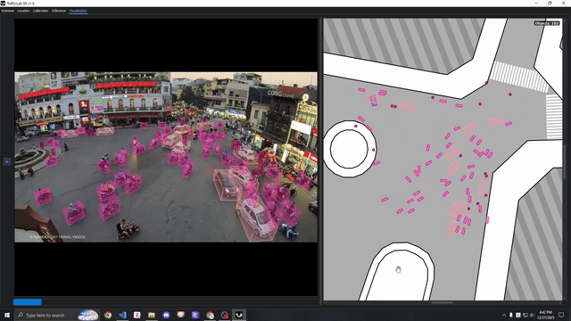
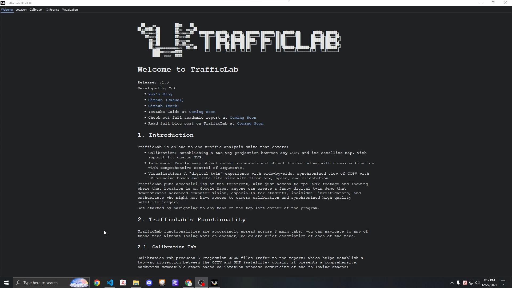
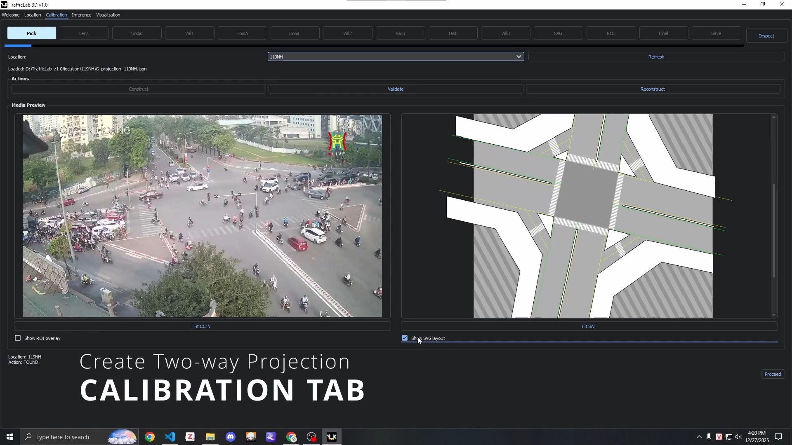
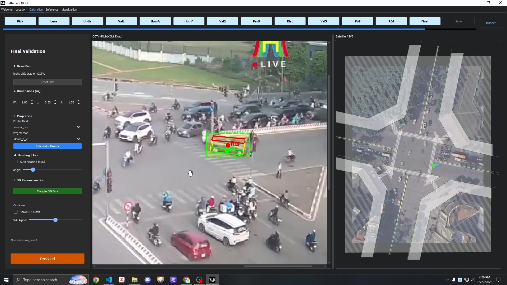
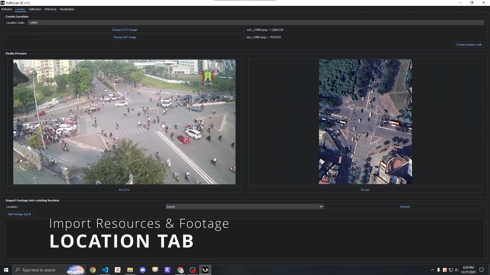
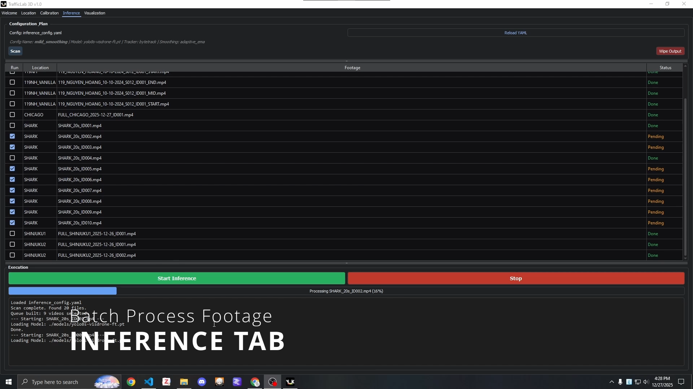
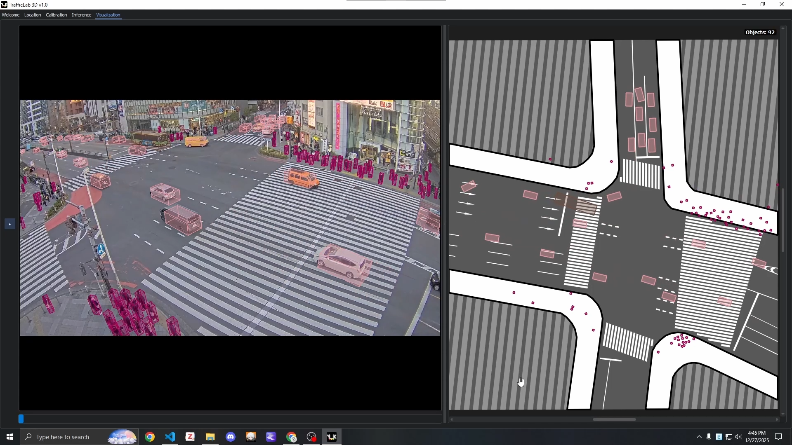

# TrafficLab 3D

TrafficLab 把車禍事故影片重建成地圖上的 2D 行車軌跡。只要有 mp4 CCTV 影片、知道拍攝地點在 Google Maps 上的位置，任何人都能重現事故當下車輛的移動軌跡與相對位置，即使沒有專業的攝影機校正設備或高品質衛星影像，也能做出具說服力的事故重建動畫，適合學生、個人調查者與相關研究愛好者使用。



Release: v1.2

原作者：Yuk（[部落格](https://yuk068.github.io/) · [GitHub](https://github.com/yuk068)）

Demo 影片、完整學術報告、部落格文章等資源請見 [Yuk's Blog](https://yuk068.github.io/2026/02/20/traffilclab-3d-overview)。

**強烈建議在自己的機器上執行本程式前先讀完這份 README。點[這裡](#getting-started)可跳到 Getting Started。**

```
TrafficLab-3D/
├── location/
│   └── {location_code}/
│       ├── footage/
│       │   └── *.mp4
│       │
│       ├── illustrator/                 （選填，Adobe Illustrator 素材）
│       │   ├── layout_{location_code}.ai
│       │   ├── roi_{location_code}.ai
│       │   └── *.ai
│       │
│       ├── G_projection_{location_code}.json
│       ├── cctv_{location_code}.png     （必要！）
│       ├── sat_{location_code}.png      （必要！）
│       ├── layout_{location_code}.svg   （選填）
│       └── roi_{location_code}.png      （選填）
│
├── media/                               （README 與 Introduction tab 用的素材）
│
├── trafficlab/
│   ├── gui/                              （GUI 實作，含獨立的校正工具視窗）
│   ├── inference/                        （原生 YOLO 偵測＋追蹤 pipeline）
│   ├── keypoint/                         （OpenPifPaf 定位法使用的關鍵點 model）
│   ├── motion/                           （OpenPifPaf / CarFusion 關鍵點定位邏輯、運動學）
│   ├── projection/                       （G-projection、SVG、消失點與參考點校正）
│   ├── diagnostics/                      （校正／幾何驗證用的診斷腳本邏輯）
│   ├── trajectory/                       （推論後的軌跡平滑化與靜態繪圖）
│   ├── visualization/                    （replay 載入與渲染）
│   └── io/                               （replay/config I/O 輔助工具）
│
├── scripts/                             （CLI 入口與維護用工具）
│
├── models/                              （object detection、tracker、keypoint checkpoint）
│   └── *.pt
│
├── output/
│   └── model-{model_name}_tracker-{tracker_name}/
│       └── {config-name}/
│           └── {location_code}/
│               └── *.json.gz             （原生推論輸出）
│
├── environment.yml
├── inference_config.yaml
├── prior_dimensions.json
└── main.py
```

## Introduction

TrafficLab 是一套端到端的事故重建工具，涵蓋：

- **校正（Calibration）：**在任意 CCTV 畫面與其衛星地圖之間建立雙向投影關係，支援自訂 SVG。
- **定位（Localization）：**用多種可互換的方式，逐幀把每輛車放到衛星地圖上正確的位置——原生的 YOLO bbox＋tracker pipeline，或是在畫面遮蔽嚴重、無法穩定取得乾淨 bbox 輪廓時改用關鍵點定位（OpenPifPaf 或 CarFusion）。
- **視覺化（Visualization）：**CCTV 3D bounding box 與衛星地圖 floor box／速度／朝向並排同步呈現的「數位分身」體驗，方便重現事故經過。



從程式左上角的分頁即可切換到任一功能，切換分頁不會遺失其他分頁的工作進度。

## Functionality

TrafficLab 的功能分散在 3 個主要分頁，以下簡述各分頁的用途。

### Calibration Tab



Calibration Tab 用來產生 G Projection JSON 檔（詳見學術報告），在 CCTV 與 SAT（衛星）兩個座標系之間建立雙向投影，提供完整、向下相容的階段式校正流程：

- **Phase 1：Undistort**
  - **Pick Stage：**快速驗證並初始化指定 location code 的 G Projection 建立／重建。
  - **Lens Stage：**設定 intrinsics matrix K。
  - **Undistort Stage：**調整符合 Brown-Conrady distortion model（5 個係數）的畸變係數。
  - **Validation 1：**確認 distortion 與 intrinsics 無誤，結束此 Phase。
- **Phase 2：Homography**
  - **Homography Anchors Stage：**手動點對點搭配 RANSAC solver 計算 homography。
  - **Homography FOV Stage：**檢查 warp 後的 CCTV 疊圖在 SAT 地圖上的效果，同時也是視野（FOV）多邊形的直覺化呈現。
  - **Validation 2：**在 CCTV 上點一個地面接觸點，確認它正確顯示在 SAT 地圖上。
- **Phase 3：Parallax**
  - **Parallax Subjects Stage：**標出 2 位 subject 的頭部與地面接觸點、輸入身高，計算攝影機位置。
  - **Distance Reference Stage：**輸入可從 Google Maps/Earth 取得的距離，建立 pixel-per-meter 比例。
  - **Validation 3：**點頭部位置、輸入身高，確認 CCTV 中的地面接觸點與 SAT 地圖上的實際位置正確對應。
- **選填：**
  - **SVG Stage：**計算 SVG 與 SAT 之間的 affine matrix。
  - **ROI Stage：**選擇 ROI 的丟棄策略。
- **Final Validation：**測試 2D bounding box 如何轉換成 CCTV 中的 3D box 與 SAT 中的 floor box。
- **Save Stage：**確認儲存該 location code 的 G Projection。



**關於 Location Code：**

執行校正前需先準備好對應的資料夾與檔案，程式內建的 Location Tab 可協助建立空白的 location 資料夾以供校正使用；自訂 SVG 與 ROI 可用 Adobe Illustrator 製作，詳細做法請參考部落格文章／Youtube 影片。



**獨立校正工具：**Phase 3 的 parallax 參數（攝影機高度、位置、pixel-per-meter 比例）除了精靈裡手動用 2 位 subject 校正，也可以用獨立工具求得——**參考點（reference-point）校正**工具，把同樣的手動校正方式從 2 個物件擴充到 N ≥ 2 個已知高度的參考物、可跨多個 frame 一起做最小平方擬合，得到更穩健的結果，透過 `scripts/reference_point_calibration_tool.py` 啟動獨立視窗，除非你明確套用結果，否則不會動到既有的 `G_projection_<code>.json`——目前還沒有整合進 Calibration Tab 精靈本身。（另有一個**消失點（vanishing-point）校正**工具，從畫面中點選的平行線加上一個已知高度的參考物直接解出攝影機幾何；已 archive 到 `archive/run_vp_calibration_tool.py`，因為在 test21 實測時橫向／垂直方向線收斂不出來，詳見 [docs/height-correction-algorithm-survey.md](docs/height-correction-algorithm-survey.md)。）

### 定位／Inference Tab



Inference Tab 是管理所有輸出 JSON 檔的地方，這些檔案就是視覺化引擎實際使用的資料，不需要在渲染時重新做繁重運算。這個分頁驅動的是 TrafficLab 原生的定位方法：YOLO 物件偵測＋tracker，把每輛車的地面接觸點直接投影到衛星地圖上。相關參數透過專案根目錄下的 `inference_config.yaml` 與 `prior_dimensions.json` 控制，JSON 會以壓縮的 `.json.gz` 格式儲存以節省空間。可控制的參數包含：

- 物件偵測 model。
- 物件 tracker。
- 速度與朝向的平滑化運動學參數。

當畫面沒辦法逐幀取得乾淨、未遮蔽的 bounding box 輪廓時，TrafficLab 也提供兩套關鍵點定位 pipeline，透過 CLI 執行，輸出的 replay JSON 跟其他方法一樣可以直接載入 Visualization Tab：

- **`scripts/run_keypoints_openpifpaf.py`**——每一幀跑 OpenPifPaf 的 Apollo-24 關鍵點 model，再用 height-aware 車輛模板比對關鍵點來定位每輛車。有三種關鍵點↔track 比對策略（`geometric`、`crop`、`segmentation`），以及三種定位（localizer）策略：`procrustes`（對所有高信心度關鍵點做 closed-form 擬合，一般預設）、`reprojection`（非線性最小平方擬合，更貼近原始像素位置），以及 `wheel_pair`（只用同側前後輪關鍵點——刻意做成最小化的準確度基準，適合只有輪胎清楚可見的情況，或用來跟另外兩種定位法比較）。
- **`scripts/run_keypoints_carfusion.py`**——用單階段的 CarFusion YOLOv8-Pose model（bbox＋14 個關鍵點）搭配 ByteTrack，達成相同目的、採用不同的關鍵點 model。

完整 CLI 參考（flag、method、localizer、輸出路徑）請見 `AGENTS.md`。

### Visualization Tab



輸出 JSON 檔的視覺化引擎，提供完整的工具列與快捷鍵操作，CCTV 與 SAT 面板可並排彈性顯示。由兩種關鍵點定位法產生的 replay 也會帶有逐車輛的關鍵點疊圖，可依 track 或依車輛部位（wheel/light/plate/mirror/corner/low/up）上色檢視。

### 診斷與驗證

`scripts/check_*.py`（底層邏輯在 `trafficlab/diagnostics/`）提供一系列獨立的 CLI 檢查工具，不需要跑完整推論就能驗證校正與定位的幾何是否正確——例如用合成場景自我測試消失點校正的數學是否正確、視覺化 height-correction 步驟實際帶來多少位移、檢查重投影誤差是否隨關鍵點高度增加（指向 height 模板的問題）還是維持不變（指向基礎 homography 的問題）、或是用永遠貼地的輪胎關鍵點當作對照組。當某個 location 的校正或關鍵點定位結果看起來不對勁、需要抓出是哪個環節出問題時很有用。

## Getting Started

安裝必要的 conda/venv 環境後執行 `main.py`：

```bash
conda env create -f environment.yml
python main.py
```

若想在不開 GUI 的情況下執行原生推論 pipeline，可改用 CLI 工具：

```bash
conda activate trafficlab
python scripts/run_inference.py --config-name car_heading_smooth --all-pending
```

這個指令在 `PYTORCH_ENABLE_MPS_FALLBACK=1` 尚未設定時會自動帶上，掃描 `location/*/footage/*.mp4`、跳過已有 `.json.gz` 輸出的影片，並執行與 GUI 相同的 `InferencePipeline`。

若要跑關鍵點定位 pipeline：

```bash
conda activate trafficlab
python scripts/run_keypoints_openpifpaf.py --video <video_path> --g-proj <g_proj_path> --method geometric
python scripts/run_keypoints_carfusion.py --video <video_path> --weights models/carfusion_last.pt --g-proj <g_proj_path> --sat <sat_image_path> --out <out_dir>
```

軌跡平滑化與靜態軌跡繪圖是獨立的推論後工具，三種定位方法的輸出都適用：

```bash
conda activate trafficlab
python scripts/trajectory_tools.py smooth-and-plot output/example.json.gz --location-code test1
```

實作放在 `trafficlab/trajectory/`，讓平滑化、繪圖、JSON I/O 的程式碼跟 GUI、推論 pipeline 分開維護，細節請見 `trafficlab/trajectory/README.md`。

在這個 [Google Drive](https://drive.google.com/drive/folders/14NVnbrUUfII3tRdI8OOEPnLzKbs3SPvn?usp=sharing) 裡可以找到：

- 給 `models/` 資料夾用、已 finetune 的 `YOLOv8-s` 與 `YOLOv11-s` model。
- 兩份已建好投影的同一 location code 資料夾，1 份有 SVG、1 份沒有；若需要更多已建好投影的 location，可另外聯繫。放進 `location/` 即可使用。
- 更新：已加入更多測試時用過、已建好投影的 location code，歡迎載入 TrafficLab 跑推論並檢視視覺化結果。
- 一份預先處理好、可直接視覺化的 `.json.gz` 輸出檔（需搭配同一份 Drive 裡的 `119NH` location 資料夾，放進 `location/`）。

本專案的靈感來自論文 [Rezaei et al. 2023](https://www.sciencedirect.com/science/article/pii/S0957417423007558)

## Run Configs

若想自行設定 model、調整運動學參數，需檢視 `inference_config.yaml` 與 `prior_dimensions.json` 檔案。

**注意：**此方法僅適用於單一平面環境。

## Changelog

- v1.0：初始版本。
- v1.1：重構程式碼並修正錯誤。
- v1.2：新增關鍵點定位（OpenPifPaf 與 CarFusion pipeline，含 `wheel_pair` localizer）作為原生 bbox pipeline 的替代方案；新增獨立的消失點與參考點校正工具；新增校正／幾何診斷檢查工具。

### 長期願景

希望能把這個構想擴展到城市規模，搭配自動校正與持續改進的偵測器／tracker，最終足以支援模擬、數位分身、自然語言查詢、強化學習等高保真度的下游應用。
